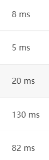
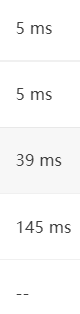
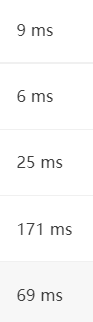

### 2021年3月23日 

16道题

A1001 A+B-Format

A1002-A+B-Poly

A1005-spell

A1006-signin-out

A1009-product-poly

A1011-bet-game

A1019-palindromic

A1027-color-mars

A1031-hw4u

A1035-passwd

A1036-boy-girls

A1042-shuffling machine

A1046-circle-distance

A1058-A+B-hogw

A1065-A+BandC

A1073-scientific-notation


A1035-password还没完成。 

### 2021年3月24日

写完了A1035 password 打算跳一跳，目前简单题刷题进度是算法笔记的上机训练指南第80页

冲到258页去

A1035-passwd

A1052-Linked-List-Sorting

A1032-Sharing-stack

A1074-Reversing-Linked-List

A1056-Mice-Rice-Queue

A1051-Pop-Sequence

今天应该是做了这些，确实比昨天有挑战性一些，虽然只是第一题这样。

离搜索专题还差一题。

### 2021年3月26日

A1097-Deduplication-on-Linked-List

### 2021年3月30日

A1103-Integer-Factorization

### 2021年3月31日

跳过了A1106

A1091-Acute-Stroke-BFS

A1020-Tree-Traversals

A1086-Tree-Traversals-Again

A1102-Invert-Binary-Tree

A1079-Total-Sales-of-Supply-Chain

A1090-Highest-Price-Supply-Chain

A1094-The-Largest-Generation

A1004-Counting-Leaves

A1053-Path-of-Equal-Weight还有最后一个测试点段错误。最后还是修好了

### 2021年4月3日

A1043 神奇的题，真的题目不说清楚。。。出题人太随意了。不需要平衡的二叉树，只需要建树，所以考察插入。题目中说了相同大小的在又子树。

A1064 升序排序，然后把数组看作层序遍历的二叉树节点，通过2X和2X+1的方法访问左右子树。进行先序遍历，依次填入排好序的数组即可。

A1099 简单的建树，排序，遍历填入。

A1066 完整实现AVL树的插入，只需要打印树根。没有节点值相同的情况。得开始利用指针的引用这一概念了。

### 2021年4月6日

A1066到今天才完成。

A1107并查集，但是稍微有点变化。

A1098 堆排序

A1013 图遍历

在写代码的时候还是有不少犹豫，千万要冲，像考试一样。学习新知识的时候还是不够快，不够专注，不能迅速抓住我不清楚的地方。

### 2021年4月7日

A1021 判断无环图，并找出使树深度最大的根节点。有N个节点，只有N-1条边。穷举每个节点肯定是可以的，但是还是想想更好的算法。其实只需要找到距离最远的两个点就可以了，让其中一个作为根即可？因为没有环，所以只要是可达的路径就是唯一的。只需要找到端点节点，判断它们之间的距离即可啊！！

还是不太对 因为像这样的图形： 所以随意找端点不行。

看了解析真是让我感叹，算法真的是数学题。。。还好不是任意数量的边，不然还要额外判断是否有环。

A1034 Head of a Gang 普通的遍历，但是略微繁琐。麻痹，边是无向边，权是有向权。最后还忘了字典序排序。。。这题难，有机会回来再做做。

A1076 Forwards on Weibo 建图，然后维护深度的遍历。有向无权。

### 2021年4月9日

A1003 Emergency 带权最短路径求条数。

A1018-Public-Bike-Management 最短路径，复杂的第二判。记录所有最短路径。

### 2021年4月14日

继续写A1018-Public-Bike-Management 可能会遇到需要先垫两个自行车进去，然后再拿到过多自行车。。。假如出发带0自行车，而路上允许自行车数变成负数，则需要带的自行车数根据路上过程中负得最多的数。

总之还是记录所有的最短路径然后单独判吧。TODO：思考


想想能不能优化。

犯的错：硬编码Capacity真行啊，题目条件都不用。

A1072 Gas Station 对每个Gas，调用dijstra，通过找出最短路径的最大值判断是否合法，然后最短路径的最小值是第一标尺，平均距离是第二标尺，index是第三标尺。其中距离只考虑与房子之间的距离。

最短距离 - 最大，平均距离 - 最小，index - 最小。初始值要设置为另一个极端。

### 2021年4月15日

A1087 All Roads Lead to Rome 最短路径，先维护记录路径的prev和路径数量，然后再维护点权，然后再维护路径中的节点数量。 标尺是距离cost最少 -> 点权Happ最大 -> 节点数量最少。

注意最后节点数量这个标尺，不能影响到路径数量啊。。。

### 2021年4月18日

A1007 Maximum Subsequence Sum 犯的错：

1. 没有注意输入输出是不是对的。下次如果出错，再看一遍输入输出格式。
2. 理解题目中的边界情况。问问自己这题目如果有坑，应该在哪里？
3. for 循环的continue是不是多跳过了什么。。。

本周开始根据上周速度：4题，确立本周目标：10题吧。写完就干别的。 

### 2021年4月19日

A1045 Favorite Color Stripe：最长不下降子列，只需要考虑特定数字，并且大小由给定的序列确定。

建一个color到序列中的序号的数组，然后一轮替换，这样直接变成普通的最大子列和问题。

A1040-Longest-Symmetric-String 还有一组数据没过。。。看来字符串长度边界真的不能卡太死啊。。。以后至少也要多两个吧。。。说字符串长度不超过1000，我`cin.getline`就get了1000，buf大小1001，就出问题了。。。可能是换行符的问题吧。。。改成1002和1001就好了。。。

### 2021年4月20日

A1068 Find More Coins 虽然和01背包问题不太一样，但是这题目好像是更简化了。如果把01背包问题的物品重量和价值一样，然后看最大值是不是恰好等于背包容量，确实就可以了。

~~需要从小到大输出物品价值，如果多解，输出序最小的。那我岂不是直接对输入的物品排序，从小到大选择，碰到解就直接停止就可以了。~~不对，应该是从大到小选择每件物品，越到后面越倾向于选择。这样最后1的时候就倾向于选择1。

麻了，脑子特别不清醒，二维数组动态内存分配也错了，背包问题的DP也错了。。。

A1164-Good-in-c 简单字符打印，还不在题库

A1152-Google-Recruitment 简单的字符串和素数判断，遇到的错：输出格式

A1140 Look-and-say Sequence 简单的字符串模拟。最后一组数据segfault。。。而且在自己的电脑上，直接运行会segfault，但是如果Debug模式运行则不会。。。4月27日发现是STL的问题。

### 2021年4月26日

上周日到现在只完成了7题，原计划10题。这周还是定7题的目标吧。每周从周六周日开始吧。这周五的时候结算。下周可以多一点。

### 2021年4月27日

A1136 A Delayed Palindrome 要实现字符串加法。。。输入的字符不超过1000位，于是小于1后带1000个0这个1001位的数字。每次倒过来加肯定小于等于两倍，则每一轮乘2，10轮就是乘1024，所以缓冲区至少要1004位。考虑到冗余，开1010位就够了。犯的错：没有考虑简单的情况。

A1160-Forever 忘记了gcd怎么求了。。。原来要模到0。然后是如果已知了m，则n要么不进位，是m+1，进一位是m+1-9，进两位是m+1-9-9。。。所以可以先行判断n是否合适，然后在末尾先安排上足够的9然后再安排非9字符。每安排一位，就可以判断剩下的数字的范围是否满足条件，先按照开头不能是0来吧。n位数字的范围是，从1到9*n吧。

### 2021年5月11日

A1160-Forever 

sum of all digits能否证明数字必定是两个9结尾？一个9是肯定有的。也就是说如果两数相差8，那是否能有大于2的，是素数的公约数？那公约数是3, 5, 7, 9, 11这样的。既然两数相差8，设两数有公因数3，则设两个数为3x，3y，则两数差也是这个gcd的倍数？？。。。那必不可能是8了。所以必定有两个9.

两数差的各种素因数才有可能是gcd。两数差是n*9-1，即1，8，17，26，35，44，53，62，71。正好n是从0到8。因为只有9位数。1和8去掉，17则必须要求正好两数都是17的倍数，26要求gcd是13，则两数要是13的倍数，而且gcd还不能是26，不能有2这个公因数。35倒是可以有5和7，44则只能是11，53自身是不是素数？好像是。62要求是31的倍数，71要求是71的倍数。那这搜索范围其实有点小啊。。。

首先拿到K，摆出K个槽用来放数。然后看m，遍历所有可能的delta，得到n=m+delta。对每个delta看看n是不是有对应的因数，没有就过，如果有则计算m和n的gcd是不是满足要求，满足则进入凑数过程。首先在末尾排开对应数量的9，然后再安排剩下的数。只要能安排出来就符合要求。

### 2021年5月12日

A1148-Werewolf 看来PAT第一题都是数学题啊。。。单刷第一题不现实啊。。。

如果是暴力解法，则枚举狼人组合，n方的复杂度，然后依次判断每个人是否说谎，得到bool数组。然后检测：是否只有两人说谎->狼人是否一个说谎一个不说谎。总体是n的3次方复杂度。。。

从只有两个人说谎入手。如果有人对同一个玩家表达了结果，如果结果矛盾，则必然只有一个人说谎，则可以在剩下的人里枚举说谎情况。如果对同一个玩家表达了相同的结果，则它们要么都对要么都错。都对的情况下在剩下的人里枚举说谎情况，都错的话直接验证。

真是直接暴力解法啊。。。枚举要枚举狼人，而不是枚举说谎人，从而直接从小到大枚举，找到了就直接输出最小的。

这次犯的错，第一个是忘了处理下标从0开始的情况。我就把输入的下标调整了一下。。。但是没想到第二次的问题正是因为这个，下标有正有负的时候要注意下标就不能从0开始了，因为无法区分正0和负0的情况。还好给的样例比较多。

A1165 Block Reversing 每次先拿到block的开头和结尾节点，以及下一个block的开头节点。然后在虚拟的head上做链表头处的push。即备份原有链表头指向的，链表头指向新block，新block末尾指向备份的。然后

```
HEAD→1→2→3→4→5→6→7→8   HEAD2 → -1
1. 找到开头1 结尾3 下一块开头4。
2. 备份HEAD2指向的，HEAD2指向1，3指向备份的。
HEAD→1→2→3→ -1  →4→5→6→7→8   HEAD2→1→2→3→ -1
3. 从下一块开头4继续遍历：
```

TODO A1160-Forever

### 2021年5月13日

A1161-Merging-Linked-Lists 计时，花了22分钟。可惜题库里还是没有。。。 这题挺简单的，就是简单的链表题。

A1160-Forever 花了超过半小时了。大概40分钟。题库里还是没有。这题真的毒瘤。。。做了三次了。。。

### 2021年5月15日

A1133 Splitting A Linked List 这还不简单，直接一个stack，然后遍历三次。可以，15分钟解决了。

A1157 Anniversary 字符串比较和找最大值？？ 花了差不多半小时吧，走神了。

**A1144-A1147** 找时间连着做吧，目前先留着不做。PAT3小时，到时候模拟一下。

### 2021年5月26日

目标是1小时内写完2道25分题吧。今天写1137和1138。从10点50冲到11点50。

A1137 Final Grading 数据处理。首先如果平时成绩在200以下的直接抛弃。然后是对每一个学生要计算好期中成绩和期末成绩综合得到的总成绩。然后按照总成绩和名字进行排序。。。然后再输出。输入的时候看是不是已经有他名字了，有则填结构体，没有则在末尾添加。这复杂度。。。我还是用一个string2int的map吧。

A1138 Postorder Traversal 前序和中序建树。

失败，动作还是太慢了。数据处理题花的时间太多了。建树也忘了不少。

还水了一题A1108-elevator

### 2021年5月27日

今天挑战 1141 1142

A1141 PAT Ranking of Institutions  又是数据处理题。school保存起来，然后读一个人就累加一次分数和人数。最后排序。最后输出的时候名次考虑相同排名，然后是

大失败，差不多一个小时只做完了数据处理题。。。而且最后一组数据还没过。。。

> 这个题目的最后一个point挺有趣的，如果用int进行输出就过不了，但是如果用double也过不了，在排序和排rank的时候必须用int型排序或者是floor函数处理，所以我干脆就新建一个sum变量作为最后的输出了。。。

A1142 Maximal Clique 建图，然后

1. 判断是不是clique：看看是不是两两相邻
2. 判断是不是最大的clique：看看其他节点加入后是否两两相邻，即是否存在某节点和clique内所有节点都有连接。

直接搜索有组数据超时，用了map快多了，只有60几ms。

### 2021年6月2日

也许就是要放松，学会享受学习，然后再花大量时间，才能提升水平吧。另外上次充分认识到自己的不熟练，真的感觉自己可以一题多刷几次，直到自己熟练为止。

今天刷1149 1150每个都计时半小时。

A1149Dangerous Goods Packaging 这好像不是并查集？A-B是，B-C是，但是A-C可能不是。incompatible 的有10的4次方，这个复杂度。。。其实这题就是判断边是否在图内吧。。耗时的操作是查找，从节点编号找冲突节点列表，从冲突节点列表里查找。 或者我动态构建当前图的不合法节点set，然后每次增加节点先在set里查找，再就增加set。就这样。然后外围用一个map<int, set>。

不错，刚好卡在半小时(32分钟)过了样例。只差最后一组数据过不了。待会看改成用string表示ID试试。

### 2021年6月3日

A1150 Travelling Salesman Problem 对每个路径计算长度，首先是判断是否是访问了每个城市的circuit，然后判断是否是simple，即只有起点和终点重复了。不断更新最佳的index，最后输出。判断circuit就跟着边走一遍，看是不是能走通，设置bool数组表示是否访问过。如果新访问的节点已经被访问过，就说明不是simple的。如果最后全部访问完，最后一个节点不是起始节点，则不是环。如果最后看有节点没有被访问过，有则没有访问所有节点。

路径：长度，类型，is simple，is circuit，is all visited

看来要多熟悉熟悉部分图论的基本单词啊。不然到时候得瞎猜了。上面的理清思路花了15分钟。。。最后总共花了57分钟？从10点27到11点24

A1149Dangerous Goods Packaging 继续把昨天的改成string表示编号，而不是int。。。还是不行，一时半会可能真不知道为什么这个测试点过不了了。

### 2021年6月4日

昨晚睡前还是今天早上起床想了想A1149 还是不知道为什么过不了。

接下来做A1153，A1154

A1153 Decode Registration Card of PAT 处理题，按照不同level给成绩排序，按照考场查询总人数和总分。按照日期查询考试人数。。。。花了54分钟，两个WA，两个超时。。。

有点惨，还是大改吧，Query就是Query，不要提前计算了。直接扫描一遍O(n)吧。对于排序直接用一个set，加上自定义的排序函数，对于查询某个考场的总人数和总分，还是扫描一遍，依次累加。对于按照日期查询每个考场的人数，还是扫描一遍，然后把日期放到对应的unordered_map里。。。没想到map的`operator []`居然有新建元素的功能。

太惨了，改了半天，还是只对了一个，两个WA，两个超时。。。

### 2021年6月21日

期末结束

继续折腾A1153Debug。原来这题是卡200ms，怪不得这么难过。

基准速度：



1. query type 1可以提前把输入整理好。但是排序甚至可以用我新发现的`std::set<stu, compare>`，但就是不能用cout输出！！！。

```c++
            for(auto &ele : (*vec)) {
                std::cout <<  << " " << ele.second << std::endl;
                // 使用下面的语句可以达到基准速度
                // printf("%s %d\n", ele.first.c_str(), ele.second);
            }
```

使用cout后：



1. 函数传参如果是string，一定要传引用！！不然会慢很多！！




### 2021年7月2日

A1153 Decode Registration Card of PAT 重新练了一遍，重新总结：

1. 查询真的是让查询，不是让预处理
2. 注意流程的合并。把不同查询的相同代码放到一起
3. 排序传参尽量多用引用，输入可以cin，输出只用printf。

学到了：

1. map直接方括号index如果没有找到会默认初始化。

A1010 Radix long long都存不下。。。看看题解https://www.nowcoder.com/discuss/375?type=8 。

1. 理解错题意了，另外一个数的进制的范围不一定小于36。
2. 另外就是二分的左端点的选择不一定是1，例如第二个数包含数字“5”，那么至少b要选择6进制……所以左边界应该是不知道进制的那个数每一位数字最大的加1。

### 2021年7月3日

开始使用二分继续修改A1010。https://www.zhihu.com/question/36132386 看这里学会了二分查找确信使用左闭右开写法。

知道自己当前猜测的进制太大还是太小的唯一方法就是完全计算完。所以不能计算一半发现不对就不算了。假设已知第一个数n1(10进制)，猜测第二个数为x进制，则可以把第一个数化为x进制（这样），或者把第二个数化为10进制（转化后受到unsigned long long限制）。既然第一个数都能转化为10进制，那我第二个数也能这样猜测吧，二分得小心。。。

注意总体确实没有超过unsigned long long 范围，zzzzzzzzzz在36进制是3656158440062975。二分中最大的进制是，需要猜的数是这个最大的数，另外一个数是10，答案是3656158440062975进制。二分的上限其实是max(下限，需要猜的数）。首先判断另外一个数是不是只有一位，这种情况如果另外一个数正好是，就是需要输出的最小的进制。这种情况可以归纳进二分法里。如果另外一个数不等于那一位数，则这种情况无论取多少进制都会过小。也可以归纳进二分法里，如果二分法能判断相等。

二分其实就是考虑上下限和判断方法。今天算是理解了。之后有时间把二分法总结到笔记。

### 2021年7月6日

二分法继续熟悉，需要改进下编程环境，现在windows的vscode还不能debug。

二分法还需要继续加油啊。需要继续加深理解，然后再找一道题。

> 根据lower bound定义，返回第一个index表示第一个元素不小于value，并没有歧义。回答里提到了
>
> \> 如果你想求的不是第一个不小于value的值的位置，而是任意等于value的值的位置，只需在更新区间之前先检查array[mid] == value是否成立即可。

gitpod挺好的，直接拿来可以用，但是还是不能调试，有时间搞下Windows端用dev C++的gdb的配置。

A1012-The-Best-Rank 这道题没想到也是用到了二分。平常的二分 1. 是升序序列，注意if判断条件的灵活变化，写靠左的情况 2. 大于等于给定值的第一个值，即当需要搜索的值比最小的值还小的时候，会返回index为0。
### 2021年7月13日

今天转换学习方向，开始学纯C语言的安全ACM。C语言再写了下二分的Radix，没想到第一组数据过不了。。。不知道为什么

学习方向重新回到原来的，想了半天，终于把坑题P0000做掉了。。

CIDR合并这题是真的复杂。。。我以为只要排序，没想到要合并。。。

